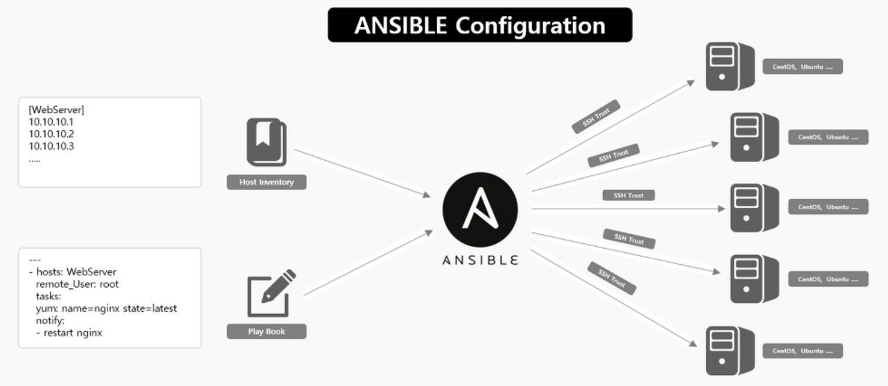

# 1 NVIDIA DeepOps 정리

> [NVIDIA DeepOps github](https://github.com/NVIDIA/deepops)

NVIDIA **DeepOps**(Deep Learning + Operations)는 GPU server cluster 환경에서 job scheduling, application 배포/프로파일링, multi-node training, monitoring, ML pipeline 실행 등의 작업을 쉽게 할 수 있도록 도와주는 PaaS이다.

> NVIDIA GPU Cloud를 줄여서 **NGC**라고 지칭한다.

> PaaS(Platform as a Service): OS, middleware, runtime과 같은 software 작성을 위한 플랫폼을 가상화하여 제공하고 관리하는 서비스. 다시 말해 OS, software update, 저장소 또는 인프라 관리 등의 작업을 사용자가 직접 하지 않고 서비스 제공자가 대신 해주는 것이다.

DeepOps 이전에는 server의 GPU를 관리하기 위해 Kubernetes와 같은 관리 툴을 이용하였는데 번거로운 작업이 많았다. 하지만 DeepOps를 사용해서 명령어 몇 줄로 job scheduling(Kubernetes, Slurm 또는 하이브리드)이 가능하게 되었다.

---

## 1.1 Job Scheduling

DeepOps는 다음 둘 중 하나의 도구를 사용해서 GPU cluster job scheduling이 가능하다.

- Slurm: 병렬 연산 job scheduler

  - batch scheduling, gang scheduling을 지원해서 다중 노드 작업에 적합하다.

  - 특히 대규모 cluster를 관리하기 쉽다.(반면 Kubernetes는 lab scale을 넘어가면 관리하기 힘들다.)

- Kubernetes: Container화된 application을 자동으로 배포, 스케일링, 관리해주는 시스템

  - Container 기반 워크로드를 관리하기 매우 쉽다.

  - Container 기반 워크로드라면 배포 자동화, 오토스케일링 등의 Slurm이 부족한 다양한 기능을 제공할 수 있다.

---

## 1.2 DeepOps 설치

> [NVIDIA DeepOps로 GPU Cluster 구축하기](https://velog.io/@chung/NVIDIA-DeepOps%EB%A1%9C-GPU-Cluster-%EA%B5%AC%EC%B6%95%ED%95%98%EA%B8%B0)

[NVIDIA DeepOps github](https://github.com/NVIDIA/deepops)에서 source code를 다운로드 받은 뒤 원하는 버전을 checkout한다.(git 개념)

선택이 끝났다면 `scripts/setup.sh` 스크립트를 실행하여 Ansible를 설치하고 기본 폴더를 구성한다.

```bash
source ./scripts/setup.sh
```

> [DeepOps: Ansible Guide](https://github.com/NVIDIA/deepops/blob/master/docs/deepops/ansible.md)

**Ansible**은 인프라 관리를 코드 기반으로 자동화해 주는 IaC(Infrastructure as Code) 도구이다. 



- (그림 중앙의 A 로고) Controller server를 두고, Controller server는 관리할 원격 server 목록(inventory = **Ansible hosts**)을 참조하여 여러 명령을 배포해 준다.

  > Controller는 Ansible에서 사용하는 용어가 아니라 설명을 위해 사용한 용어이므로 주의.

- Inventory(Ansible hosts)는 원격 서버의 IP 주소, 사용자 계정, SSH key 등의 정보를 담고 있다. etc/ansible/hosts 파일에 해당 정보들이 저장되어 있다.

  > 따라서 설치 후 Controller server와 Ansible hosts 간에 SSH Key를 공유하는 작업을 수행해 줘야 한다.

- Controller는 (YAML 파일 형태로) 원격 서버에 배포할 명령들을 모음집으로 관리한다. 이를 **Playbook**이라고 한다.

  > Container를 빌드하기 위한 Dockerfile도 playbook이 가지고 있다. 나머지는 `save.yml`, `build.yml` 등으로 명령을 저장해 둔다. 

스크립트로 설치가 끝났다면 configuration을 수정해 주어야 한다. `config/inventory` 파일을 열고 자신의 환경에 맞게 configuration(inventory)을 수정한다.

> [DeepOps: Slurm Deployment Guide](https://github.com/NVIDIA/deepops/tree/master/docs/slurm-cluster), [DeepOps: Kubernetes Deployment Guide](https://github.com/NVIDIA/deepops/tree/master/docs/k8s-cluster)

```bash
vi config/inventory
```

---

### 1.2.1 Slurm deployment

아래는 `vi config/inventory` 파일을 Slurm master node(mgmt), Slurm work node(gpu node)에 맞게 구성한 예시다.

```
[all]
mgmt01    ansible_host=10.128.0.10 # ssh reachable한 manager IP 주소
gpu01     ansible_host=10.128.0.11 # ssh reachable한 gpu server IP 주소  
 
######
# SLURM
######
[slurm-master]
mgmt01
 
[slurm-node]
gpu01
 
[slurm-cluster:children]
slurm-master
slurm-node
 
[all:vars]
# SSH User
ansible_user=deepops #ssh 접속 가능 계정
ansible_ssh_private_key_file='~/.ssh/id_rsa'
```

> Slurm과 함께 설치되는 Grafana, Prometheus로 시스템 모니터링이 가능하다.

> Grafana: http://<slurm-master>:3000, Prometheus: http://<slurm-master>:9090

추가로 (Slurm) configuration paramter를 수정하고 싶다면 `config/group_vars/slurm-cluster.yml` 파일을 열어서 수정하면 된다.

예를 들면 한 서버에서 장애가 발생해도 다른 호스트에서 작업을 수행할 수 있게 옵션을 수정할 수 있다. 

- `slurm-master` group을 multiple host로 등록한다.

- `config/group_vals/slurm-cluster.yml`에서 `slurm_enable_ha: true`로 설정한다.

이렇게 configuration 수정이 끝났다면 한 차례 verify 작업을 거친 뒤 Slurm을 설치한다.

```bash
# Verify
ansible all -m raw -a "hostname"

# install Slurm
# 만약 SSH가 password가 필요하면 '-k' 옵션을 추가한다.
# 만약 remote machine이 sudo 권한이 필요하면 '-K' 옵션을 추가한다.
# 만약 SSH 사용자가 현재 사용자와 다르다면 '-u ubuntu' 옵션을 추가한다.
ansible-playbook -l slurm-cluster playbooks/slurm-cluster.yml
```

---

### 1.2.2 Kubernetes deployment

아래는 `vi config/inventory` 파일을 Kubernetes master node(mgmt), Kubernetes work node(gpu node)에 맞게 구성한 예시다.

```
[all]
mgmt01    ansible_host=10.128.0.10 # ssh reachable한 manager IP 주소
gpu01     ansible_host=10.128.0.11 # ssh reachable한 gpu server IP 주소
 
[etcd]
mgmt01
 
[kube-master]
mgmt01
 
[kube-node]
gpu01
 
[all:vars]
# SSH User
ansible_user=deepops #ssh 접속 가능 계정
ansible_ssh_private_key_file='~/.ssh/id_rsa'
```

이렇게 configuration 수정이 끝났다면 한 차례 verify 작업을 거친 뒤 Kubernetes를 설치한다.

```bash
# Verify
ansible all -m raw -a "hostname"

# install Kubernetes
# 만약 SSH가 password가 필요하면 '-k' 옵션을 추가한다.
# 만약 remote machine이 sudo 권한이 필요하면 '-K' 옵션을 추가한다.
# 만약 SSH 사용자가 현재 사용자와 다르다면 '-u ubuntu' 옵션을 추가한다.
ansible-playbook -l k8s-cluster playbooks/k8s-cluster.yml
```

설치가 끝났다면 Kubernetes cluster가 잘 구성되었는지 확인해 보자.

```bash
# Verify that the Kubernetes cluster is running
# manually run해야 한다면 이 명령을 먼저 실행한다. `sudo cp ./config/artifacts/kubectl /usr/local/bin`
kubectl get nodes
```

---

## 1.3 Slurm Validation Playbook

Slurm 설치가 끝났으면 Slurm validation 예제를 진행해 보자. DeepOps에서 예제를 위해 제공해 주는 playbook `slurm-validation.yml`을 이용한다.

> [slurm-validation.yml](https://github.com/NVIDIA/deepops/blob/master/playbooks/slurm-cluster/slurm-validation.yml)

이 validation playbook은 NCCL tests를 실행하면서, Pyxis와 Enroot가 모든 노드에서 GPU 작업을 잘 실행하는지 확인한다.

- NCCL(NVIDIA Collective Communication Library)은 NVIDIA GPU에 최적화된 다중 GPU 및 다중 노드 집단 통신 프리미티브를 의미한다.(Nickel으로 발음)

- Pyxis: Slurm에서 GPU 작업을 실행하기 위한 Container 플러그인. srun에서 `sqsh` Container 파일을 주고 받을 수 있다.

- Enroot: 경량 Container runtime 도구. Docker image를 `sqsh`(squashFS. 고압축 파일시스템) 파일 형태로 관리한다.

> [Slurm, Pyxis, Enroot 설명](https://docs.likejazz.com/wiki/HPC/)

진행하기 앞서 `slurm-validation.yml`을 잠시 살펴보자. 일부 자신의 환경에 맞게 수정해 둘 필요가 있을 수 있다.

- 처음 빌드해서 수행하는 경우 `compile_nccl_tests`를 True(default)로 두어야 한다.

- 만약 이미 NCCL tests를 compile했다면 `compile_nccl_tests`를 False로 두어야 한다.

- 나머지 수정은 아래 주석을 보고 자신의 환경에 맞게 설정

```
    # (문자열) NCCL performance/validation test를 수행할 Container
    # docker tag나 sqsh 파일 경로를 입력한다.
    base_container: "nvcr.io/nvidia/tensorflow:21.09-tf2-py3"

    # (문자열) 'nccl_tests_container'라는 변수를 만들고 이미 존재하는 Container를 가리키게 하거나, 없으면 Container를 생성해서 가리키게 한다.
    # 아래 `compile_nccl_tests`가 True이면 sqsh 파일이 된다.
    # 아래 `compile_nccl_tests`가 False이면, docker tag나 sqsh 파일이 된다.
    nccl_tests_container: "${HOME}/enroot_images/nccl_tests_slurm_val.sqsh"

    # (불리언) 'compile_nccl_tests'라는 불리언 변수를 만든다.(위 파일의 존재 여부에 따라 설정)
    # 'compile_nccl_tests'가 True이면, NCCL test를 compile하고 'base_container'에 추가한다. 이때 'nccl_tests_container'에 compile된 결과물(sqsh 파일)을 저장한다.
    # 'compile_nccl_tests'가 False이면, 이미 존재하는 'nccl_tests_container'를 사용해서 NCCL test를 실행한다.
    compile_nccl_tests: True

    # (문자열) NCCL allreduce test 명령.
    allreduce_command: "all_reduce_perf -b 1M -e 4G -f 2 -g 1"

    # (정수형) 노드당 GPU 개수. (DGX-1와 DGX A100 Server는 8 GPU를 갖는다)
    # (DGX-2는 16 GPU를 갖는다)
    num_gpus: 8

    # (문자열) 사용할 Slurm parition
    partition: batch

    # (시간 문자열) Slurm job의 time limit.
    timelimit: "10:00"

    # (문자열) srun 명령을 export한다.
    srun_exports: NCCL_DEBUG=INFO

    # (문자열) srun option들을 작성하여 커스텀 가능하다.
    srun_options:

    # (정수형 혹은 비워둘 수 있다.); node 총 개수. 만약 비워두면 partition의 모든 idle nodes를 사용한다.
    num_nodes:

    # (불리언) playbook 실행이 끝나면 `nccl_tests_container`을 삭제할지 여부를 결정할 수 있다.
    # 단 `compile_nccl_tests`도 마찬가지로 True일 때만 가능하다.
    cleanup: False
```

다음은 `slurm-validation.yml` 중간에 있는 `srun` 명령을 살펴보자. 위 `slurm-validation.yml`를 그대로(default) 수행하면 batch partition의 모든 idle node에서 allreduce NCCL test를 진행할 것이다.

이때 옵션 `num_nodes`를 수정하면 더 적은 node 혹은 더 많은 node(지정한 수만큼 node가 idle해질 때까지 작업이 queue된다(대기열에서 대기한다).)를 사용해서 수행하게 override할 수 있다.

```bash
srun --export={{ srun_exports }} \
   -p {{ partition }} \
   --time {{ timelimit }} \
   -N {{ num_nodes }} \
   --ntasks-per-node={{ num_gpus }} \
   --gpus-per-task=1 \
   --exclusive \
   --mpi=pmi2 \
   --no-container-remap-root \
   --container-image="{{ nccl_tests_container }}" \
   {{ srun_options }} \
   {{ allreduce_command }}
```

---

## 1.3 Slurm Validation

1. 이제 default 설정으로 모든 idle node가 NCCL tests를 수행하게 해보자.

```bash
ansible-playbook -l slurm-cluster playbooks/slurm-cluster/slurm-validation.yml
```

위에서 언급한 대로 `${HOME}/enroot_images/nccle_tests_slurm_val.sqsh` Container 파일이 생성될 것이다.

2. 이번에는 PyTorch base container를 사용해서 2 node로 NCCL tests를 수행하는 예시를 보자. 몇 가지 커스텀 사항을 추가했다.

- pytorch base container로 수정한다.

- custom location에 sqsh 파일을 저장하도록 override한다.

- UCX(Unified Communication X)와 HCOLL(Hierarchical Collectives)을 사용하지 않도록(disable) 설정한다.

  > UCX는 고성능 분산 컴퓨팅을 위한 library로, InfiniBand와 같은 저지연 네트워크를 통해 memory sharing 및 통신을 처리한다.

  > HCOLL는 MPI(Message Passing Interface) program에서 hierarchical 통신 패턴을 처리하기 위한 library이다. MPI의 기본 통신 함수를 대체하여 효율적인 분산 통신을 지원한다.

- 끝난 뒤 cleanup을 수행한다.

```bash
ansible-playbook -l slurm-cluster playbooks/slurm-cluster/slurm-validation.yml \
  -e '{base_container: nvcr.io/nvidia/pytorch:21.09-py3}' \
  -e '{nccl_tests_container: "${HOME}/enroot_images/nccl_tests_torch_val.sqsh"}' \
  -e '{num_nodes: 2}' \
  -e '{srun_exports: "NCCL_DEBUG=INFO,OMPI_MCA_pml=^ucx,OMPI_MCA_coll=^hcoll"}' \
  -e '{cleanup: True}'
```

3. docker repo의 NCCL container를 사용하는 1 node test

```bash
ansible-playbook -l slurm-cluster playbooks/slurm-cluster/slurm-validation.yml \
  -e '{nccl_tests_container: deepops/nccl-tests-tf20.06-ubuntu18.04:latest}' \
  -e '{compile_nccl_tests: False}' \
  -e '{num_nodes: 1}'
```

이렇게 수행한 NCCL allreduce test 결과는 다음 파일에 write되어 저장된다.

- `/tmp/nccl_tests.out`: playbook이 성공적으로 run됐을 경우

- `/tmp/nccl_tests.err`: NCCL tests가 오류로 실패했을 경우

---

