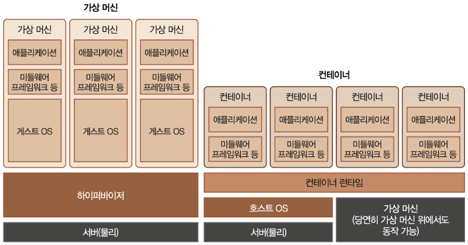

# 1 Docker 기초

**Docker**(도커)는 가상실행 환경을 제공하는 오픈소스 플랫폼이다.

- 이렇게 제공하는 가상실행 환경을 **Container**(컨테이너)라고 부른다.

- Docker 플랫폼이 설치된 환경이면, 컨테이너로 묶인 application을 어디서든 실행할 수 있다.

> 특히 클라우드 컴퓨팅이 발전하면서 이러한 컨테이너 기술은 더욱 중요해졌다.

---

## 1.1 Docker의 장점

Docker는 다음과 같은 장점을 가진다.

- **Standard**(표준화): process가 어떠한 방식으로 작동하든 상관없이, <U>동일한 형식으로 process를 실행하고 관리</U>할 수 있다.

- **Portability**(이식성): program이 어디서 어떻게 만들어졌든 상관없이, Docker 플랫폼에서 실행된다면 <U>동일한 실행 환경으로 process를 작동</U>시킬 수 있다.

- **Lightweight**: Docker의 Container는 <U>host OS의 kernel을 공유</U>하기 때문에, 컨테이너를 실행하는데 필요한 리소스가 적다.

- **Secure**: Container는 고립된 환경에서 실행되므로 보안 측면에서 유리하다.

---

### 1.1.1 Container vs Virtual Machine

Docker는 process의 실행 환경을 가상화한다. 그런데 마찬가지로 resource를 가상화하고 고립시키는 기술로 Virtual Machine(VM)가 존재했는데 과연 Docker와 어떤 차이점이 있을까?



- Virtual Machine(VM)

  - server에 **hypervisor**(하이퍼바이저)를 설치하고, 그 위에 virtual OS와 App을 패키징한 VM을 만들어서 실행한다.(Guest OS 단위)

  - 1개의 server를 여러 개의 server처럼 사용할 수 있다. 개별 VM이 독립적인 OS를 갖는다.(대신 그만큼 overhead가 크다.)

  > 다시 말해 hardware level의 가상화를 지원한다.

- Container

  - host OS에 **container runtime**(컨테이너 런타임)을 올리고, 그 위에 process로 Container를 동작시킨다.

  - host kernel을 공유하지만 개별적인 user space(사용자 공간)을 가진다.

  > host OS의 kernel을 공유하면서 분리된 process로 실행해 마치 VM이 동작하는 것처럼 보이게 하는 기술이다. 다시 말해 OS level의 가상화를 지원한다.

참고로 VM에서 hypervisor란 hardware와 VM들 사이에서 '가상화를 위해 hardware를 제어하면서 동시에 각각의 VM을 관리하는 역할을 하는 소프트웨어'이다. 물리적인 resource를 VM에게 할당하면서 I/O 명령을 처리해서 VM이 원활하게 동작할 수 있는 환경을 제공한다.

---

### 1.1.2 Docker image

Docker는 마치 CD player와 동일하다. 사용자가 CD만 들고 있으면 CD player가 있는 어느 컴퓨터에서든지 CD를 재생할 수 있는 것과 마찬가지다. Docker **image**만 가지고 있다면 Docker deamon이 설치된 어느 컴퓨터에서도 Docker process를 실행시킬 수 있다.

- Docker image: 사용자가 실행할 코드가 든 binary이다. CD처럼 한번 생성하면 수정이 불가능ㅎ다ㅏ.

- Dockerfile: Docker image를 만들기 위한 recipe이다. 

- Docker container: Docker image가 memory 위에 상주하며 실제로 코드가 수행되는 process이다. 종료 시 모든 data가 휘발된다.

- 원격 레지스트리(Registry): Docker image를 저장하는 원격 저장소이다. Docker Hub, AWS ECR, GCP Container Registry 등이 있다.

---

### 1.1.3 Docker 설치

Ubuntu 20.04 기준으로 다음 명령어로 Docker를 바로 설치할 수 있다.

```bash
sudo apt update && suda apt install -y docker.io net-tools
sudo usermod -aG docker $USER

# 서버를 재시작
sudo reboot
```

---

## 1.2 Docker 기본 명령어

Docker 컨테이너를 하나 실행해 보자. 간단히 일반 process 하나를 실행하는 것과 별반 다르지 않다. 

linux에서 cowsay라는 process를 실행하는 것과, Docker Container로 whalesay(docker 버전 cowsay)를 실행하면서 한 번 비교해 보자.

우선 linux 명령어에서 cowsay를 실행해 보자.

```bash
# 설치
sudo apt install -y cowsay

# 실행
cowsay hello world!
```

---

### 1.2.1 Container 실행

Docker 버전의 whalesay를 실행해 보자. `docker run`이라는 명령 뒤에 실행하려는 `image`, 그 다음 Container에 전달할 `인자`를 순서대로 입력하면 된다.

> 로컬에 해당 image가 없지만 자동으로 원격 레지스트리에서 다운로드 받아 실행한다.

```bash
docker run docker/whalesay cowsay hello world!
```

- `docker/whalesay`: (Docker Hub에서 제공하는) whalesay image

- `cowsay hello world!`: Container에 전달한 인자

앞 예제를 자세히 살펴보면 image가 '\/'로 구분되어 있다. docker image 주소는 다음과 같은 뜻을 갖는다. 도메인 주소 형식으로 생각하면 된다.

- <registry 이름>/<image 이름>:<TAG>

즉, docker가 `registry` 이름이고, whalesay가 `image` 이름이다.

> `TAG`는 생략되었는데, default로 latest라는 TAG가 사용된다.

> default registry 주소는 docker.io이다.

> 따라서 docker/whalesay == docker.io/whalesay:latest와 같다.

이번에는 docker/whalesay image에 다른 패러미터(`echo`: 문자열 또는 텍스트를 터미널에 출력하는 명령어)를 전달해 보자.

```bash
docker run docker/whalesay echo hello
```

패러미터를 바꾸니 수행하는 명령이 달라졌다. 다음은 `-d` 옵션으로 Container를 백그라운드에서 실행해 보자. image로 'nginx'라는 것을 쓰는데 로컬에 없어서 자동으로 원격 레지스트리에서 가져올 것이다.

```bash
docker run -d nginx
```

> image 전체 주소는 다음과 같다. nginx == docker.io/nginx:latest

'-d' 옵션으로 Container를 실행하자 `CONTAINER_ID`가 반환되었다. 백그라운드에서 실행하였으므로 이 `CONTAINER_ID`를 이용해 조회해야 한다.

---

### 1.2.2 Container 조회

이제 실행한 Container를 조회해 보자. `docker ps` 명령을 이용한다. linux에서도 `ps` 명령어를 이용해서 현재 실행 중인 process의 정보를 얻을 수 있는데, docker에서도 마찬가지의 역할을 수행한다.

```bash
docker ps
```

앞서 1.2.1절에서 `-d` 옵션으로 실행한 `CONTAINER_ID`를 확인할 수 있다. nginx image가 실행되고 있는 것이 확인된다.

---

### 1.2.3 Container 상세 정보 확인

`docker ps`보다 더 자세한 정보를 확인하고 싶다면 `docker inspect` 명령을 이용하면 된다. `docker inspect` 명령 뒤에 조회하고 싶은 Container의 `CONTAINER_ID`를 입력하면 된다.

```bash
docker inspect <CONTAINER_ID>
```

---

### 1.2.4 Container logging

`docker logs` 명령을 이용하면 Container에서 출력되는 log 기록도 확인할 수 있다.

다음 예시는 `-f` 옵션(follow output)을 이용해 현재 백그라운드에서 실행되는 Container의 log를 실시간으로 확인하는 명령이다.(Ctrl+C로 logging을 종료할 수 있다.)

```bash
docker logs -f <CONTAINER_ID>
```

---

### 1.2.5 Container 명령 전달

간혹 실행 중인 Container에 명령을 전달해야 할 때가 있다. 이럴 때는 `docker exec` 명령을 이용하면 된다.

다음 예시는 실행 중인 nginx image Container에 wget을 설치하고 localhost로 요청을 보내는 명령이다.

```bash
docker exec <CONTAINER_ID> sh -c 'apt update && apt install -t wget'
docker exec <CONTAINER_ID> wget localhost
```

---

### 1.2.6 Container/Host간 파일 복사

실행한 Container와 Host server 사이를 `docker cp` 명령을 이용해 파일을 주고받을 수도 있다. 우선 host server에서 Container로 파일을 전송해 보자.

- Container 내부의 '/usr/share/nginx/html' 경로로 '/etc/passwd' 파일을 복사할 것이다. 

> 이 '/usr/share/nginx/html' 경로가 바로 nginx server의 웹 서빙 디렉터리이다.

```bash
# docker cp <HOST_PATH> <CONTAINER_ID>:<CONTAINER_PATH>
docker cp /etc/passwd <CONTAINER_ID>:/user/share/nginx/html/.
```

제대로 파일이 복사가 됐는지 다음 명령으로 확인해 보자.

- `curl <URL>` 명령어로 URL의 정보를 가져와 STDOUT(즉, 터미널에 표시)한다.

```bash
docker exec <CONTAINER_ID> curl localhost/passwd
```

이번에는 Container에서 Host로 파일을 복사해 보자.

```bash
# docker cp <CONTAINER_ID>:<CONTAINER_PATH> <HOST_PATH>
docker cp <CONTAINER_ID>:/usr/share/nginx/html/index.html  .
```

host에서 기존대로 쉽게 확인할 수 있다.

```bash
cat index.html
```

---

### 1.2.7 Container 중지

사용을 마쳤으면 `docker stop` 명령어로 Container를 중단한다. 예시로 백그라운드에서 실행시킨 nginx image를 중단시켜 보자.

```bash
# docker stop <CONTAINER_ID>
docker stop <CONTAINER_ID>

# 확인
docker ps
```

참고로 `docker ps` 명령에 `-a` 옵션을 붙여서 조회하면 이미 종료한 Container까지 확인할 수 있다.

```bash
docker ps -a
```

---

### 1.2.8 Container 재개

중단시킨 Container를 `docker start` 명령으로 재시작시킬 수도 있다.

```bash
# docker start <CONTAINER_ID>
docker start <CONTAINER_ID>
```

---

### 1.2.9 Container 삭제

중단시킨 Container를 `docker rm` 명령으로 아예 삭제할 수도 있다. 먼저 `docker stop` 명령으로 중단시키고 삭제해야 한다. 이렇게 삭제한 Container는 다시 재개할 수 없다.

```bash
# docker rm <CONTAINER_ID>
docker rm <CONTAINER_ID>
```

`docker ps -a` 명령으로 조회하면 nginx image Container가 삭제되었음을 확인할 수 있다.

```bash
docker ps -a
```

---

### 1.2.10 Interactive Container

`docker run` 명령으로 image를 실행할 때 `-it` 옵션(interactive(STDIN, STDOUT 연결) tty(터미널 연결)의 약자)을 같이 사용하면 직접 Container 안으로 접속해서 작업할 수 있다.

다음은 ubuntu:16.04 image를 `-it` 옵션을 이용해 실행하며 bash 쉘을 실행하는 예제다.

```bash
docker run -it ubuntu:16.04 bash
```

그럼 Container 내부로 접속한 것을 확인할 수 있다. `exit` 명령을 이용해 Container에서 빠져나올 수 있다.

앞서 `docker run -it`로 image 실행과 동시에 실행시키지 않아도, `docker exec -it` 명령을 이용하면 이미 생성한 Container에도 접속이 가능하다.

```bash
# nginx image 실행
docker run -d nginx

# exec 명령(-it 옵션)을 통해서 bash 접속
docker exec -it <CONTAINER_ID> bash
```

주로 이렇게 Container에 접속해서 debugging 및 패키지 설치를 수행한다. 하지만 Container는 휘발성 process이므로, <U>작업하며 생성한 모든 data와 패키지는 Container를 삭제하면 사라진다</U>는 점에 유의해야 한다.

---

## 1.3 원격 레지스트리

image 원격 저장소로 Docker Hub가 있다. github를 떠올리면 쉽다.

> [Docker Hub](https://hub.docker.com/)

---

### 1.3.1 Docker Tag

image에 `docker tag` 명령을 이용해서 새로운 이름을 부여할 수 있다. 예시로 nginx image에 새 이름을 부여해 보자. 

- <USERNAME>/nginx 형태로 이름을 부여할 것이다.

```bash
# docker tag <OLD_NAME>:<TAG> <NEW_NAME>:<TAG>
docker tag nginx:latest erectbranch/nginx:1
```

예시에서 TAG를 1로 부여했는데 생략 시 default인 latest가 자동으로 부여된다.

---

### 1.3.2 images 확인, 삭제

앞서 에시를 수행하면서 원격 저장소에서 자동으로 다운로드 받은 image 리스트를 `docker image` 명령으로 확인할 수 있다.

`docker rmi <IMAGE_NAME>` 명령으로 image를 삭제할 수 있다.

---

### 1.3.3 Docker Hub upload

이제 원격 저장소 Docker Hub에 image를 업로드해 보자. 우선 `docker login` 명령으로 Docker Hub에 로그인한다. 계정 이름과 비밀번호를 차례로 입력한다.

```bash
docker login
```

Login Succeeded 문구가 출력되었으면 제대로 로그인에 성공한 것이다. 이제 `docker push <USERNAME>/<IMAGE_NAME>` 명령으로 내 image를 업로드해 보자.

```bash
# docker push <USERNAME>/<IMAGE_NAME>
docker push erectbranch/nginx
```

다운로드는 `docker pull <IMAGE_NAME>` 명령으로 간단히 수행할 수 있다.

---

## 1.4 Dockerfile 작성

지금까지는 다른 사용자가 만든 Docker image로 Container를 실행했다. 이번에는 직접 나만의 Docker Image를 만들어 보자.

이를 위해서는 우선 특정한 명령을 담은 Dockerfile을 작성해야만 Docker image를 만들 수 있다. Dockerfile은 다음과 같은 명령들을 담고 있다.

- Dockerfile에 base image를 지정

  - 예를 들어 리눅스 배포판을 base image로 삼아 custom image를 만들 수 있다. 컨테이너로 사용하기 위해 최소화된 image로 제공하므로 용량이 크지 않다.(ubuntu:18.04 image의 경우 63.3MB)

- 원하는 software 및 library를 설치하기 위한 명령을 기술

- Container 실행 시 수행할 명령을 기술

---

### 1.4.1 Dockerfile 기초

그럼 이제 간단한 예제를 통해 Dockerfile을 작성해 보자. 우선 다음과 같은 간단한 hello.py 파이썬 스크립트를 이용하는 Dockerfile을 작성한다고 하자.

```Python
# hello.py
import os
import sys

my_ver = os.environ["my_ver"]
arg = sys.argv[1]

print("hello %s, my version is %s!" % (arg, my_ver))
```

위 hello.py 스크립트를 Docker image로 작성하기 위해 Dockerfile을 만들어 보자.

```
# Dockerfile
FROM ubuntu:18.04

RUN apt-get update \
    && apt-get install -y \
        curl \
        python-dev

WORKDIR /root
COPY hello.py  .
ENV my_ver 1.0

CMD ["python", "hello.py", "guest"]
```

- `FROM`: base image를 지정한다.

- `RUN`: 기록한 명령을 실행해 준다.(image로 build하는 단 한 번만 수행)

- `WORKDIR`: image의 working directory를 지정한다. 예시는 /root로 지정했다.

- `COPY`: localhost에 존재하는 파일을 image 내부로 복사한다.

- `ENV`: image의 환경변수를 지정한다.

- `CMD`: image 실행 시, 별다른 명령을 넘겨주지 않으면 default로 실행되는 명령을 지정한다.(Container를 실행할 때마다 수행)

---

### 1.4.2 Docker Build

이렇게 Dockerfile까지 작성했다면 이제 `docker build` 명령으로 image로 변환할 수 있다.

- `-t` 옵션(tag)을 넣으면 해당 경로에서 build할 image와 tag 지정이 가능하다.

```bash
# docker build <PATH> -t <IMAGE_NAME>:<TAG>
docker build . -t hello:1.0
```

이렇게 build를 수행하면 Dockerfile에 기록된 명령들이 순차적으로 실행된다. 이제 이렇게 만들어진 image를 한 번 실행해 보자.

```bash
docker run hello:1

# 패러미터를 넘겨서 기존 CMD를 override
docker run hello:1 echo "hello world!"

# hello.py 스크립트를 확인
docker run hello:1 cat hello.py

# image의 working directory 확인
docker run hello:1 pwd
```

참고로 Container를 실행할 때 `-e` 옵션을 같이 사용해서 환경변수를 주입할 수 있다.

```
# docker run -e KEY=VALUE <REGISTRY>/<IMAGE>:<TAG>
docker run -e my_ver=1.5 hello:1
```

---

### 1.4.3 Dockerfile 심화

- **ARG** 

Dockerfile 안에서 사용할 수 있는 패러미터를 정의한다. `docker build` 명령으로 image를 build할 때 `--build-arg` 옵션을 통해 패러미터를 넘길 수 있다.

앞서 작성한 Dockerfile에 ARG를 추가해 보자.

```
FROM ubuntu:18.04

RUN apt-get update \
    && apt-get install -y \
        curl \
        python-dev

ARG my_ver=1.0

WORKDIR /root
COPY hello.py  .
ENV my_ver 1.0

CMD ["python", "hello.py", "guest"]
```

이렇게 `ARG`로 명시한 패러미터를 `--build-arg` 옵션을 이용해서 override해 보자.

```bash
# override 빌드
docker build . -t hello:2 --build-arg my_ver=2.0

# 실행
docker run hello:2
```

이렇게 image build 시점에서 환경변수 값을 override했지만, `docker run`으로 image를 실행하면서 계속해서 여전히 환경변수 값을 바꿔줄 수 있다.

```bash
docker run -e my_ver=2.5 hello:2
```

- **ENTRYPOINT**

`CMD`와 유사하지만 `docker run`에 의해 override되지 않는다. 한번 `CMD` 대신 Dockerfile에 추가하고 비교해 보자.

```
FROM ubuntu:18.04

RUN apt-get update \
    && apt-get install -y \
        curl \
        python-dev

WORKDIR /root
COPY hello.py .
ENV my_ver 1.0

ENTRYPOINT ["python", "hello.py", "guest"]
```

앞서 `CMD`는 docker run을 하면서 `'echo "hello"` 명령을 패러미터를 전달받아서 override되었다. 하지만 `ENTRYPOINT`로 작성했을 경우 실행 명령이 override되지 않고 지정한 명령이 그대로 실행된다.

```bash
# ENTRYPOINT 버전 빌드
docker build . -t hello:3

# 패러미터를 입력하여 실행 명령
# 하지만 ENTRYPOINT로 지정한 명령이 그대로 실행된다.
docker run hello:3 echo "hello"
```

그렇다면 guest 부분은 패러미터로 넘겨줄 수 있게 Dockerfile을 수정해 보자.

```
FROM ubuntu:18.04

RUN apt-get update \
    && apt-get install -y \
        curl \
        python-dev

WORKDIR /root
COPY hello.py .
ENV my_ver 1.0

ENTRYPOINT ["python", "hello.py"]
```

`ENTRYPOINT`에서 "guest" 부분을 지웠다. 이를 다시 빌드해서 'new-guest'라는 패러미터를 전달하며 이미지를 실행해 보자.

```bash
docker build . -t hello:4

# 패러미터를 전달해서 실행 명령
docker run hello:4 new-guest
```

이렇게 실행한 경우 전달된 'new-guest'가 그대로 패러미터로 전달되어 실행된다.(마치 python hello.py new-guest 명령을 실행한 것과 같다.)

> 간단히 말해 `CMD`는 별다른 명령을 패러미터로 주지 않으면 default로 실행되는 명령이고, `ENTRYPOINT`는 image 실행 때 무조건 호출되는 명령이다. `ENTRYPOINT`를 사용했을 때 패러미터를 전달하면 그대로 `ENTRYPOINT`의 패러미터로 전달이 된다.

> 그런데 아예 override가 불가능한 것은 아니다. `docker run --entrypoint`처럼 `--entrypoint` 옵션을 주고 실행하면 강제로 override가 가능하다.

---

## 1.5 docker run 고급

`docker run` 명령에서 사용할 수 있는 몇 가지 옵션을 더 탐색해 보자.

---

### 1.5.1 Network

Container가 외부 트래픽을 전달 받아야 하는 상황이 있을 수 있다. 이럴 때는 로컬 host server와 Container의 port를 매핑시켜서 통신이 가능하게 forwarding을 시켜주어야 한다. `-p` 옵션을 사용한다.

다음 예시는 host의 5000 Port를 Container의 80 Port와 mapping하는 명령이다.

```bash
# docker run -p <Host_Port>:<CONTAINER_PORT> <IMAGE_NAME>
docker run -p 5000:80 -d nginx

# 5000번으로 localhost를 호출한다.
curl localhost:5000

# 혹은 내부/퍼블릭 IP로도 확인할 수 있다.
curl <내부/퍼블릭 IP>:5000
```

웹 브라우저로 접속하려면 '내부/외부 IP:5000'으로 접속하면 된다.

---

### 1.5.2 Volume

앞서 Container는 휘발성 process로 종료되면 파일 시스템도 함께 삭제된다고 소개했다. 하지만 Volume을 사용해서 Container의 data를 localhost의 파일 시스템과 연결할 수 있다. 이렇게 localhost에 data를 저장하면 Container가 종료되어도 data가 유지할 수 있다.

> 이를 **volume mount**(볼륨 마운트)라고 한다. 

게다가 host server의 디렉터리와 연결하는 만큼 host server에서 파일을 손쉽게 수정할 수 있다는 장점이 있다. 따라서 변경 사항이 많은 파일은 Volume으로 두어서 사용하는 편이 더 유지보수가 간편하다.

우선 `docker run` 명령 실행 시 `-v` 옵션(Volume)을 사용해서 host의 디렉터리와 Container의 디렉터리를 연결하는 방법을 살펴보자.

- host의 현재 디렉터리와, Container의 `/user/share/nginx` 디렉터리를 연결할 것이다.

```bash
# docker run -v <HOST_DIR>:<CONTAINER_DIR> <IMAGE_NAME>
docker run -p 6000:80 -v $(pwd):/user/share/nginx/html/ -d nginx
```

이제 `echo` 명령을 이용해서 localhost의 현재 디렉터리에 hello.txt 파일을 생성하고, Container에서 해당 파일이 확인되는지 한 번 확인해 보자.

> `echo <문자열> > <파일명>`으로 바로 문자열이 든 파일을 write할 수 있다. 꺽쇠를 두 번(>>) 사용하면 파일에 문자열을 추가(append)한다.

```bash
echo hello! >> $(pwd)/hello.txt
```

이제 Container에서 해당 파일이 보이는지 확인해 보자.

```bash
curl localhost:6000/hello.txt
```

---

### 1.5.3 User

기본적으로 Container의 user는 root이다. 하지만 보안을 위해서 root가 아닌 일반 user를 사용하게 설정할 수 있다. 이를 위해서는 Dockerfile 내부에 다음과 같은 명령을 추가해 주면 된다.

```
# Dockerfile
# base image
FROM ubuntu:18.04

# Ubuntu user 생성
# adduser에 'disabled-password' 옵션으로 password 입력 없이, 'gecos ""' 옵션으로 user 정보를 입력 없이 ubuntu라는 이름의 게정을 만든다.
RUN adduser --disabled-password --gecos "" ubuntu

# 위에서 만든 ubuntu user로 Container가 실행된다.
USER ubuntu
```

이제 작성한 Dockerfile을 바탕으로 image를 빌드하고 실행해 보자.

```bash
# my-user라는 image 생성
docker build . -t my-user

# ubuntu라는 이름의 user로 Container 실행
docker run -it my-user bash
```

이렇게 실행한 경과를 보면 ubuntu라는 계정명을 가진 user로 Container가 실행되었음을 확인할 수 있다. root 권한이 필요한 명령을 사용할 경우 permission denied가 발생한다.

또한 `docker run` 시 `--user` 옵션을 줘서 해당 user로 Container를 실행할 수도 있다. 아래 예시는 root 권한으로 Container를 실행하는 명령이다.

```bash 
docker run --user root -it my-user bash
```

---

### 1.5.4 Clean up

마무리로 생성한 모든 Container와 image를 삭제하는 명령을 살펴보자.

```bash
# 모든 Container 삭제
docker rm $(docker ps -a -q) -f

# 모든 image 삭제
docker rmi $(docker images -q) -f
```

---